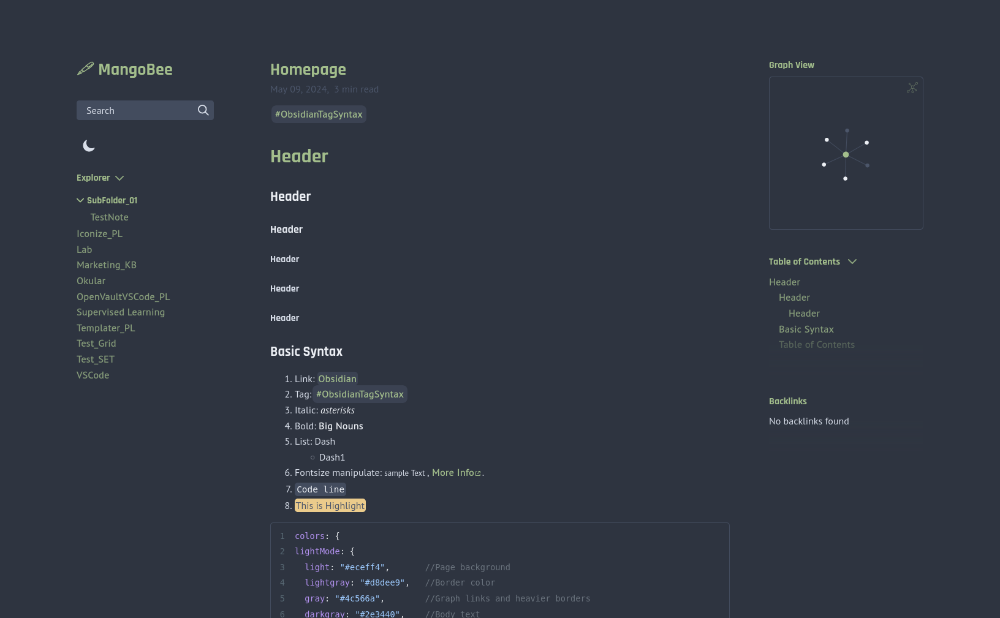
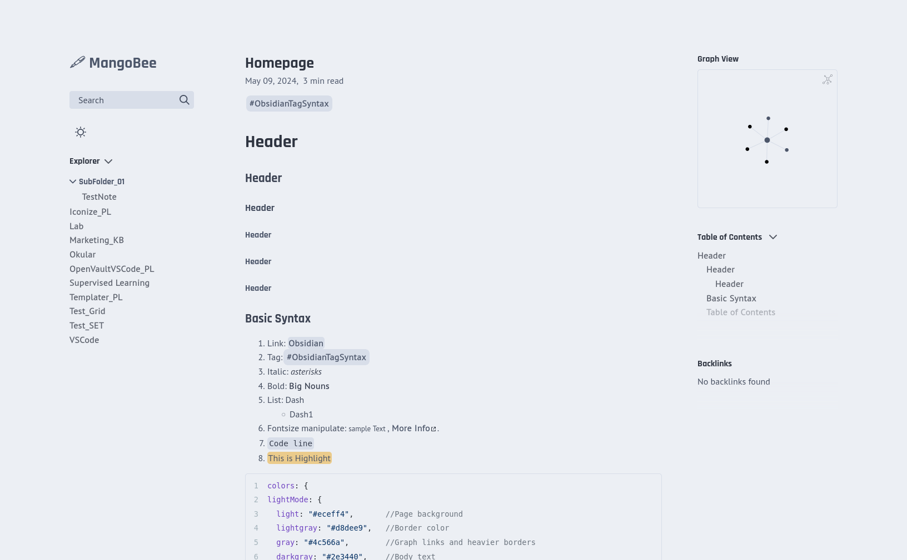

## Understanding the concept
- I have a clear objective of this project: i will try to replicate my all time favorite theme: [Nord](https://www.nordtheme.com/)
- It is one of rare thing that i love almost every aspect of it without any further customization needed. At the same time, i havent had confident to build or rebuild any my own theme because i always feel it will be a tedious tasks just for the fact that much of color of choices are given.
- Up till that day when my first website that i built dont have theme to select to, i know that its time for me to settle down and learn for it.
- I believe that well product have well design phylosophy, so my approach is to find a guide that can explain each and every single element of color on Nord, which is the theme that i want to replicate.
- After sometime of research, i come across to the homepage of [Nord](https://www.nordtheme.com/) and on it, they have a page dedicated to what i looking for.
- Every time i try to design anything, i follow these principle which i learn from my mechanical engineer background: simplicity over function over style.
- By understanding the concept, here is my quick perception about the functions of their four main color pallete:
	- Polar Night: Foundation for dark theme
	- Snow Storm: Foundation for light theme
	- Frost: Low colors pallete for styling
	- Aurora: Strong colors pallet for styling
undefined
## What to apply?
Now, what missing left is where or what to apply. And thanks for a guides and asking community, i locate most basic elements that appear on every webpages, which is ultimately a objects for applying styling
- Background: Darkest/Brightest color from *PolarNight* or *SnowStorm* pallete: `#2e3440`
- Body Text: Logically, most contrast color to background will be chosen, most common pair is `#2e3440`/`#3b4252`, which is the highest contrast pair. However, it will prevent you from minimize number of color used. E.g. you will need Forst or Aurora pallete to built heading, italic, bold, hyperlinks, code block etc. to differentiate to text. So the trick will be using color in between these two pallete: `#d8dee9` for dark- and `#4c566a` for white theme. With this setup, now you can differentiate heading important from 1 to 6 with color that stronger than these two. For `#d8dee9` will be `#eceff4` and `#e5e9f0` (total 2), for `#4c566a` will be `#424c5e` up to `#2e3440` (total 3). As you can notice, its not enough for differentiate all six of headings, but in reality, you need only practically 3 headings to documents your notes, more than that will be definitely confused by readers. Therefore, headings colors are mapped as follow:
	- White Theme:
		- Heading 1: `#2e3440`
		- Heading 2: `#424c5e`
		- Heading 3: `#4c566a` 
	- Dark Theme:
		- Heading 1: favorite of choice
		- Heading 2: `#eceff4`
		- Heading 3: `#e5e9f0`
- By "favorite of choice" i mean you can choose any prefer styling color from Frost and Aurora. This design approach will help to prevent styling over functionality, since all colors of nord theme is your favorite and you want to use more than one, you should also keep in mind that we are building theme purposely for public website.
- Three core elements of any markdown text is locked, now we can move on to other important elements
- Element 01: Border color
	- Which is all lines that either straight line seperate your text section, to border line around your code block, table and so on. And depend how sharp you want your page to look, you can choose highest contrast pair (must/should be in same color pallette).If more color border line type (normal or heavy) are required to distingush, , same technique that is present above can be applied.
- Element 02: hyperlink
	- Two parameter to decide here: color of background and text
	- The more its differentiate from background, the more its emphasize. What i would prefer to minium differentiation to keep it's lowkey, since its already have highlighted border. And for text i simply reused normal text color.
- Element 03: Hover effect.
	- It happens when your cursor hover on top of links or dimmed text. Its not of that important but it does make your website look professional. Color here is free to choose, for me i choose strong color that contrast to background.
- Element 04: Bold and Italics
	- italic have different texture that is pop up on plain text, bold however is somewhat similar especially on darkmode. you can recognise far better a little bit of dark than a little bit of white. That why non-fully-contrast text to background plays an important role here. you can now pick counterpart of highest contrast pair (`#2e3440`/`#3b4252`) to background that pallete offer, which results in bold and italics slightly brighter/darker than plain text.
- Element 05: Hightlighted Text
	- Yellow (`#ebcb8b`) is the classic for highlighted text, we want to achieve it also in darktheme. To do that only yellow background isnt enough, but the white text should be change to dark color also. In `.css` you can achieve by declare two parameter: `color:` & `background`. Apart from yellow which can be found in Aurora, other common highlighted color would be green or orange depend on your preferences.
- Element 06: Selected Text
	- Its a effect when you hold & drag on text. It helps reader to temporary focus on the line that they are reading, so it should be construct with same effect like hightlighted text. Avoid to choose same highlighted color. My suggest combination would be Highlighted/Selected =  `#ebcb8b`/`8fbcbb`.
- Element 07: Code or Code Block.
	- text if declare under code environment will be render with different font and style. You can define language what language are presented in code block to make it tranform into right color pallete of that language.
	- So the color you define here is on general environment where no specific language is defined. I stick with same color as plain text since its already have seperate border line and background.
- Follow these principle helps me to create my favorite custom nord theme which i still use till today. Hope these helps you on your journey to build your dream theme!

## More Style - More Font
- `header`: Font to use for headers - `Rajdhani`
	- What to look for: condensed, little whitespace
	- Try: `Nanum Myeongjo`, `Sedan SC`, `Playfair Display` 
- `code`: Font for inline and block quotes. - `roboto condesed`
	- Look for more whitespace (mono space, simple robot style)
	- Try: `Source Code Pro`, `IBM Plex Mono`
- `body`: Font for everything - PT Sans
	- Sansrif is king in for body website.
	- Try: Open Sans, Quicksand.
